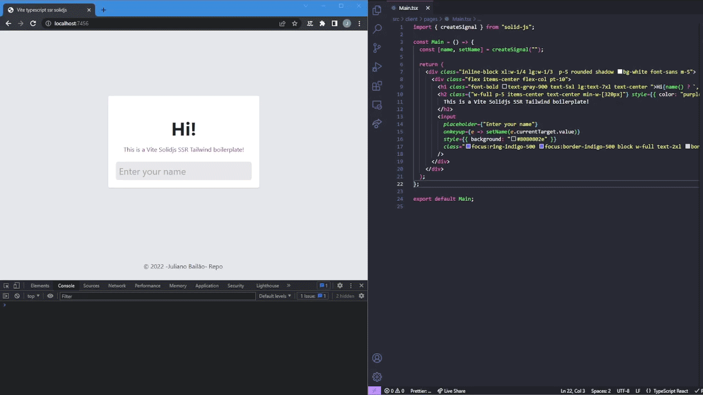

# Vite Typescript Solidjs SSR

[](https://github.com/julianobailao/vite-typescript-solidjs-ssr/actions/workflows/nodejs.yml)

A _blazingly_ modern web development stack. This template repo tries to achieve the minimum viable example for each of the following:



- [Solidjs 1.4](https://www.solidjs.com)
- [Typescript 4.7](https://devblogs.microsoft.com/typescript/announcing-typescript-4-7/)
- [Vite with Vite SSR](https://vitejs.dev/guide/ssr.html)
- [Vitest](https://vitest.dev)
- [GitHub Actions](https://github.com/features/actions)
- [Tailwind CSS](https://tailwindui.com/)
- [Prettier](https://prettier.io/) & [ESLint](https://eslint.org/)

## Development

```
yarn
yarn dev:server
```

That should start the server. It will open to http://localhost:7456.

If you'd like to just develop the UI, you can use

```bash
yarn
yarn dev:client
```

To start the native vite client.

## Building

```
yarn build
yarn serve
```

yarn build will create the assets in `dist` - a `client` and `server` folder. Serve will run `dist/server.js` with Node, but feel free to change this to use Docker or some other process manager to suit your deployment needs.

## Testing

```
yarn test:client
yarn test:server
```

### Vitest UI

That is pretty cool!

```
yarn vitest:client
yarn vitest:server
```


See the oficial documentation [here](https://vitest.dev/guide/ui.html)

## Files

`eslintrc.js` - a barebones eslint configuration for 2021, that extends off of the recommended ESLint config and prettier

`.prettierrc.js` - the prettier config

`index.html` - the vite entrypoint, that includes the entry point for the client

`postcss.config.cjs` - CommonJS module that defines the PostCSS config

`server.ts` - The barebones Express server with logic for SSRing Vite pages

`tailwind.config.cjs` - CommonJS module that defines the Tailwind config

`tsconfig.json` - TypeScript configuration

`vite.config.ts` - Vite configuration

`vitest.config.ts` - Vitest client tests configuration

`vitest.server.config.ts` - Vitest server tests configuration

## CI

We use GitHub actions to build the app. The badge is at the top of the repo. Currently it just confirms that everything builds properly.

## Thanks

This project is strong based on [https://github.com/jonluca/vite-typescript-ssr-react]()
